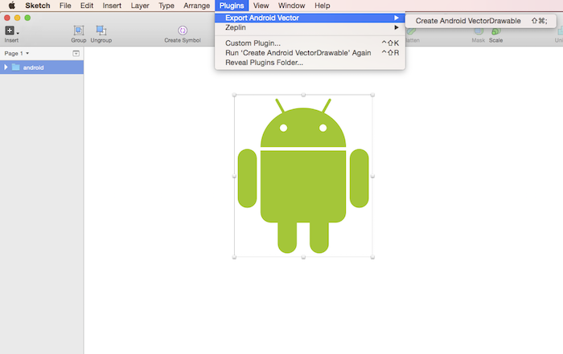

# Export Android VectorDrawable

Exports assets as VectorDrawable for Android. Say goodbye to a bajillion assets.



Supports [VectorDrawable] as well as [vector-compat].

Turns svg:

```
<?xml version="1.0" encoding="UTF-8" standalone="no"?>
<svg width="131px" height="131px" viewBox="0 0 131 131" version="1.1" xmlns="http://www.w3.org/2000/svg" xmlns:xlink="http://www.w3.org/1999/xlink" xmlns:sketch="http://www.bohemiancoding.com/sketch/ns">
    <!-- Generator: Sketch 3.3.3 (12072) - http://www.bohemiancoding.com/sketch -->
    <title></title>
    <desc>Created with Sketch.</desc>
    <defs></defs>
    <g id="Page-1" stroke="none" stroke-width="1" fill="none" fill-rule="evenodd" sketch:type="MSPage">
        <circle id="Oval-8" stroke="#7E7E7E" stroke-width="20" fill="#7ED321" sketch:type="MSShapeGroup" cx="65.5" cy="65.5" r="65.5"></circle>
    </g>
</svg>
```

Into VectorDrawable xml:

```
<?xml version="1.0" encoding="utf-8"?>
<vector xmlns:android="http://schemas.android.com/apk/res/android"
    xmlns:app="http://schemas.android.com/apk/res-auto"
    android:width="131dp"
    android:height="131dp"
    android:viewportWidth="131"
    android:viewportHeight="131"
    app:vc_viewportWidth="131"
    app:vc_viewportHeight="131">

    <path
        android:name="Oval-8"
        android:fillColor="#7ED321"
        android:strokeColor="#7E7E7E"
        android:strokeWidth="20"
        android:pathData="M 65.5 0 C 101.674651114 0 131 29.3253488861 131 65.5 C 131 101.674651114 101.674651114 131 65.5 131 C 29.3253488861 131 0 101.674651114 0 65.5 C 0 29.3253488861 29.3253488861 0 65.5 0 Z"
        app:vc_fillColor="#7ED321"
        app:vc_strokeColor="#7E7E7E"
        app:vc_strokeWidth="20"
        app:vc_pathData="M 65.5 0 C 101.674651114 0 131 29.3253488861 131 65.5 C 131 101.674651114 101.674651114 131 65.5 131 C 29.3253488861 131 0 101.674651114 0 65.5 C 0 29.3253488861 29.3253488861 0 65.5 0 Z" />
</vector>
```


## Installing Plugins
### The conventional way:
1. [Download the ZIP file with the Measure](https://github.com/utom/sketch-measure/archive/master.zip)
2. Copy the contents to the plugin folder (Open up Sketch, and go to `Plugins` › `Reveal Plugins Folder…` to open it.)

### The quickest way:

_NOTE: If your Mac has not installed GitHub client, You need to install [GitHub for mac](https://mac.github.com)_

1. Click on the [Clone in Desktop](github-mac://openRepo/https://github.com/utom/sketch-measure) button on GitHub
2. Press `command` + `shift` + `g` to find plugin folder, then paste plugin folder path

**Plugin Folder Path**

* App Store `~/Library/Containers/com.bohemiancoding.sketch3/Data/Library/Application Support/com.bohemiancoding.sketch3/Plugins`
* Beta `~/Library/Application Support/com.bohemiancoding.sketch3/Plugins`

## Shortcuts

* Export: cmd + shift + ;

## Props to:

* [svg2android]. Svg to VectorDrawable webpage (super cool). A lot of the translation is based off this.
* [sketch-export-assets]. What I based this sketch plugin off of.

[svg2android]:https://github.com/inloop/svg2android
[sketch-export-assets]:https://github.com/geertwille/sketch-export-assets
[VectorDrawable]:https://developer.android.com/reference/android/graphics/drawable/VectorDrawable.html
[vector-compat]:https://github.com/wnafee/vector-compat
